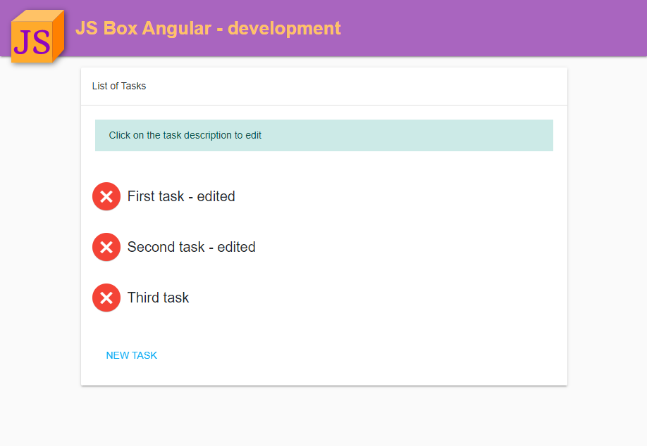
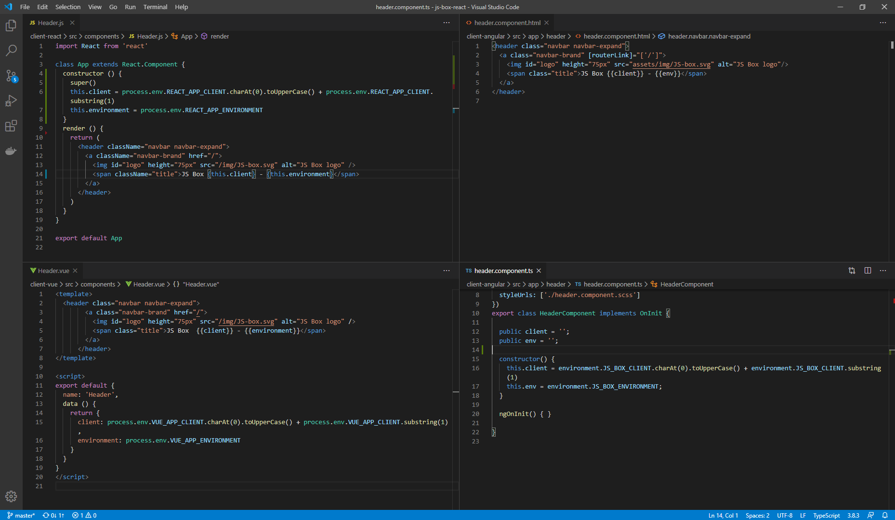

# About JS Box

This project started as a learning process to better understand Docker, docker-compose. After creating the first version with [React](https://reactjs.org/), I decided to include [Angular](https://angular.io/), so I could better understand the differences.

Later on, after everything was working, I decided to include [Vue](https://vuejs.org/).

## Clients

All the clients behave the same, with the same functionalities, the same ability to access environment variables (in different ways, check the instructions).

I tried my best to name files, components and methods the same, use the same logical behaviour, but needed to adapt some parts where the frameworks differ.

I have plans to keep expanding this project with new UI frameworks and maybe other backends, also.

## Docker-compose version

I decided to use docker-compose version 2 because it allows me to use `extends` and create different configurations for dev and prod. Version 3 lost this ability.

## Docker

It took me a while to understand Docker, what runs when, when the files from the host are mounted, when should I run npm install, when to run build.

I studied a lot to understand it and this is a TL;DR summary:

1. Everything on `docker-compose` files are used to create the container (think about it as the "hardware" of the VM) and image (the installed software, from the OS to the things you install over the OS).
2. Still on `docker-compose` files, the `command` is what will "RUN" in the machine. This command needs to be a 'daemon' type of executable.... it needs to keep running.
3. On the `Dockerfile`, RUN commands are executed during the image creation.
4. On the `Dockerfile`, CMD is similar to the `docker-compose` `command`... it's what will be executed after everything.
5. Image mounting only happens when Docker will run, so if you try to use things from your local machin inside Docker, this needs to be fired on `CMD` or `command`. If you need to do it defore, you will need to use the `COPY` command.
6. Be careful with `COPY` and `VOLUME`. If you copy something during the image construction and have a `volume` later on, the volume may overwrite all you copied!
7. Using you local `node_modules` as a volume insie docker can fail because your machine might not be the same OS of the Docker machine and some dependencies are native code, with diferent binaries per OS.

# TODO / Wish list

- [x] Protect MongoDB with a password, as it can be accessed externally.
- [x] Make all clients as similar as possible, including naming and logic.
- [x] Fix issues with $ on NGINX
- [x] validationAndSanitization for Angular and Vue
- [ ] Secure the API - CORS, CSRF, SESSION, COOKIE, AUTH&AUTH... https://blog.insiderattack.net/developing-secure-node-js-applications-a-broad-guide-286afdec69ce
- [ ] https://preactjs.com/
- [ ] https://svelte.dev/
- [ ] https://hapi.dev/
- [ ] https://koajs.com/
- [ ] Other DBs???
- [ ] https://lumen.laravel.com/ ???
- [ ] Understand and maybe implement Webpack compilation on all versions
- [ ] "Compile" - copy all configs selected to a single place
- [ ] CLI - cli to generate the app only with the chosen configuration
- [ ] Move each client / server to another git - see how much this complicates the whole development
